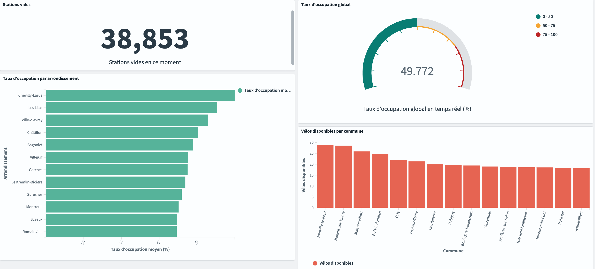

# Vélib' Streaming Pipeline

Pipeline de données temps réel ingérant les données de disponibilité des stations Vélib' (Paris),
les traitant avec Apache Spark Structured Streaming, et les exposant sur deux couches de stockage complémentaires.

---

## Architecture

```
API Vélib' (opendata.paris.fr)
        │
        ▼
Producer Python (confluent-kafka)
        │
        ▼
Apache Kafka — topic "velib-stations"
        │
        ▼
PySpark Structured Streaming
        │
        ├──▶ OpenSearch + Dashboards  (données chaudes — dashboard temps réel)
        └──▶ BigQuery                 (données froides — historique analytique)
```

---

## Dashboard temps réel



---

## Stack technique

| Composant | Technologie |
|---|---|
| Ingestion | Python, `confluent-kafka`, `requests` |
| Message broker | Apache Kafka 4.0 (KRaft, sans ZooKeeper) |
| Traitement streaming | PySpark Structured Streaming 3.5 |
| Stockage chaud | OpenSearch 2.11 + Dashboards |
| Stockage froid | Google BigQuery (Sandbox) |
| Conteneurisation | Docker Compose |
| CI/CD | GitHub Actions (lint ruff + pytest) |
| Packaging Python | uv |

---

## Prérequis

- Docker Desktop
- Un compte GCP avec un projet BigQuery (Sandbox suffit)
- Une clé de compte de service GCP → `spark/service-account.json`

---

## Lancer le projet

```bash
docker compose up -d
```

Le pipeline démarre entièrement en une commande.

- Dashboard temps réel : http://localhost:5601
- Logs Spark : `docker compose logs -f spark`

Arrêt (sans perdre les données OpenSearch) :

```bash
docker compose down
```

---

## Structure du projet

```
velib_streaming_pipeline/
├── .github/
│   └── workflows/
│       └── ci.yml              # GitHub Actions : lint + tests
├── docs/
│   └── dashboard.png           # Screenshot du dashboard temps réel
├── producer/                   # Producer Kafka Python
│   ├── tests/
│   │   └── test_producer.py
│   ├── Dockerfile
│   ├── main.py
│   ├── pyproject.toml
│   └── uv.lock
├── spark/                      # Job PySpark Structured Streaming
│   ├── Dockerfile
│   ├── main.py
│   ├── service-account.json    # ⚠️ dans .gitignore — à fournir manuellement
│   ├── pyproject.toml
│   └── uv.lock
├── .gitignore
└── docker-compose.yml
```

---

## Choix architecturaux

**Pourquoi deux sinks ?**
OpenSearch sert les agrégats fenêtrés pour un dashboard temps réel (couche chaude).
BigQuery conserve le grain fin station par station pour des requêtes analytiques SQL a posteriori (couche froide).

**Pourquoi `confluent-kafka` ?**
C'est un binding Python sur librdkafka (bibliothèque C), le client Kafka utilisé en production.
`kafka-python` est une implémentation Python pure, adaptée au prototypage uniquement.

**Pourquoi Kafka KRaft sans ZooKeeper ?**
Historiquement, Kafka dépendait de ZooKeeper, un logiciel externe dont le seul rôle était de gérer les métadonnées du cluster (quel broker est le leader, quelles partitions sont actives). Cela impliquait d'opérer deux systèmes distincts en parallèle. Kafka 4.0 supprime cette dépendance avec KRaft : Kafka gère désormais lui-même ses métadonnées, un seul processus suffit.

**Pourquoi `foreachBatch` pour les sinks ?**
Il n'existe pas de connecteur natif Spark pour OpenSearch ou BigQuery Sandbox. `foreachBatch` permet d'écrire du code Python custom à chaque micro-batch, sans dépendre de connecteurs tiers.

**Pourquoi `stationcode` comme clé de partition Kafka ?**
Garantit que tous les messages d'une même station arrivent dans le même partition et dans l'ordre chronologique, essentiel pour un traitement correct des événements par station.

**Pourquoi une fenêtre glissante 5min/2min ?**
Recalcul toutes les 2 minutes sur les 5 dernières minutes. Le watermark de 10 minutes tolère les messages en retard et libère la mémoire Spark.